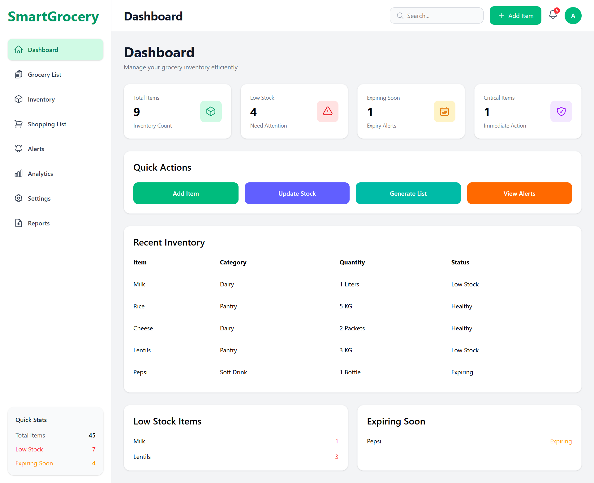
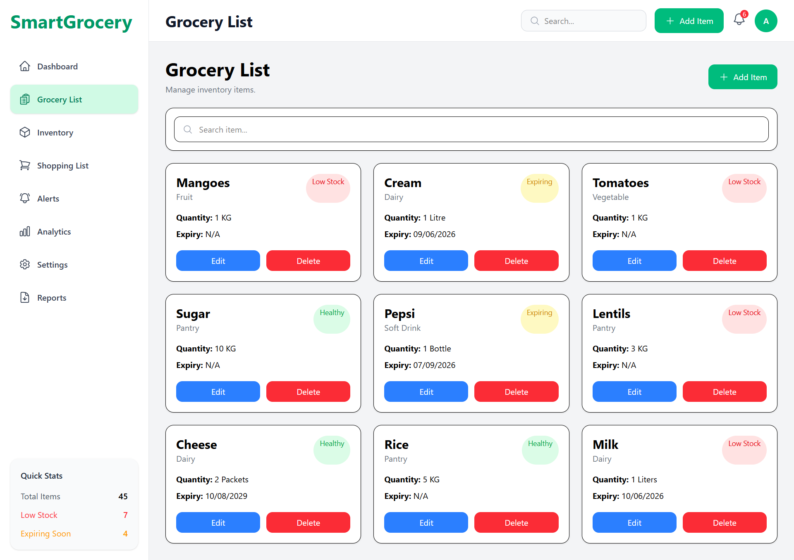
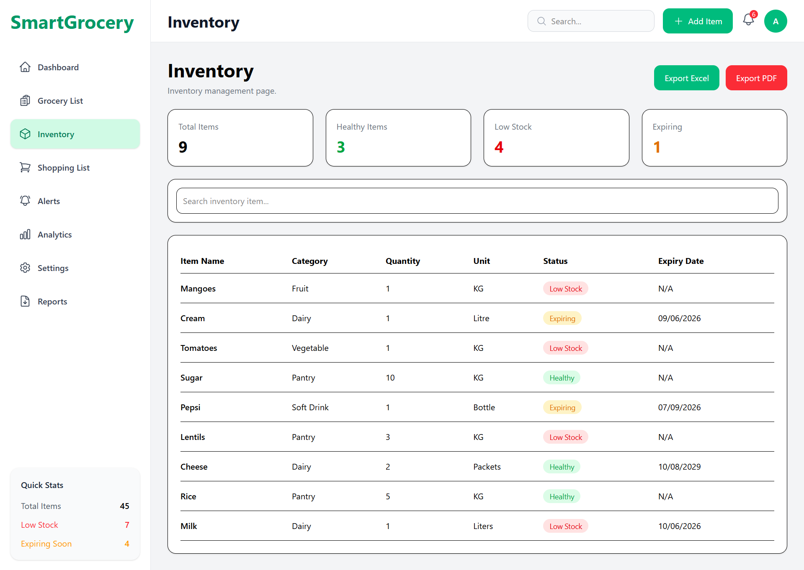
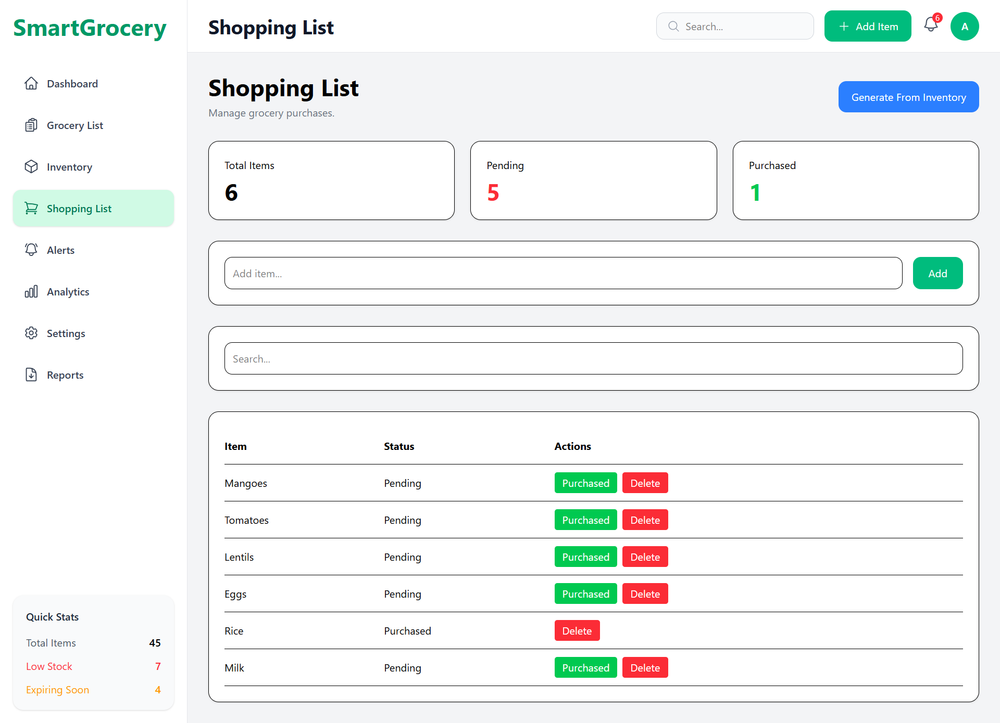
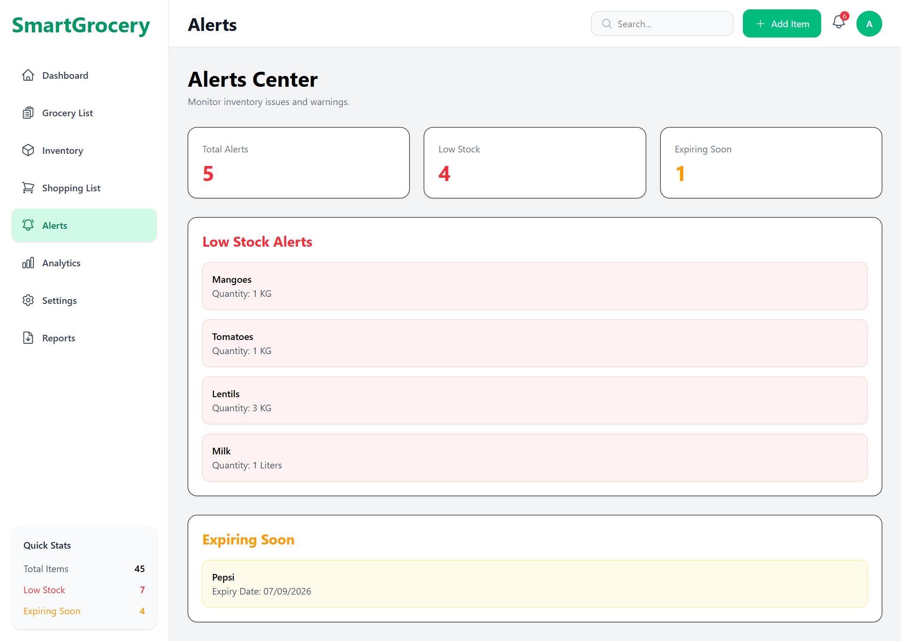
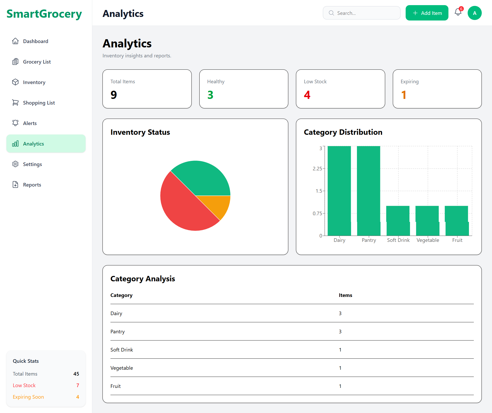
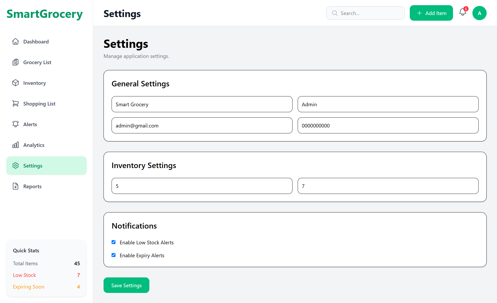
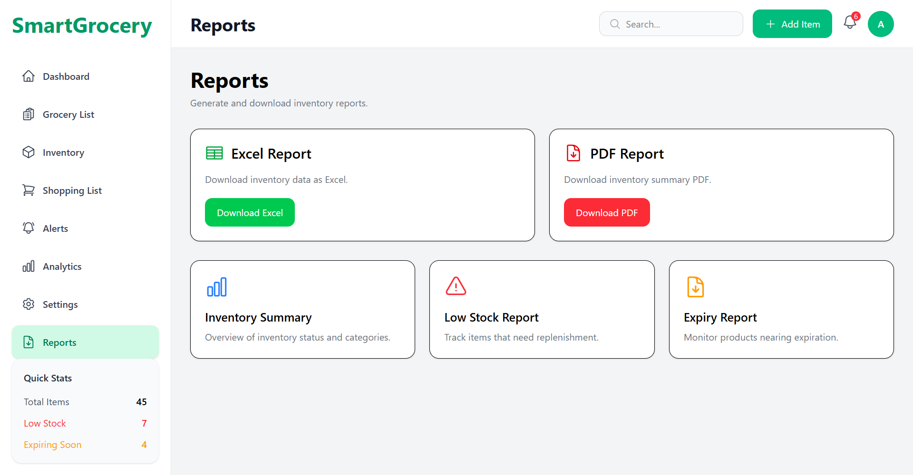

# 🛒 Smart Grocery Inventory Manager

A full-stack grocery inventory management system that helps users track grocery items, monitor stock levels, generate shopping lists, receive expiry alerts, analyze inventory data, and export reports.

Built using the MERN Stack with a modern and responsive dashboard UI.

---

# 📌 Project Overview

Smart Grocery Inventory Manager is designed to simplify household and small-store inventory management.

Users can:

- Add and manage grocery items
- Monitor low-stock products
- Track expiry dates
- Generate shopping lists automatically
- Receive inventory alerts
- Analyze inventory trends
- Export reports in Excel and PDF formats

The system provides a centralized dashboard for managing groceries efficiently and reducing wastage.

---

# ❗ Problem Statement

Managing groceries manually often leads to:

- Forgotten items
- Duplicate purchases
- Expired products
- Stock shortages
- Lack of inventory visibility

This project solves these problems by providing a digital inventory management platform with automated monitoring and reporting features.

---

# ✨ Features

## Dashboard

- Inventory overview
- Total items count
- Low stock monitoring
- Expiring products tracking
- Critical items display
- Quick action buttons

---

## Grocery Management

- Add grocery items
- Edit item details
- Delete items
- Search items
- Categorize products

Supported Categories:

- Dairy
- Pantry
- Fruit
- Vegetable
- Soft Drink
- General

---

## Inventory Management

- View complete inventory
- Track quantities
- Monitor stock status
- View expiry dates
- Export inventory reports

Inventory Status:

- Healthy
- Low Stock
- Expiring

---

## Shopping List

- Create shopping items manually
- Generate shopping list automatically from low-stock inventory
- Mark items as purchased
- Delete shopping items
- Track pending purchases

---

## Alerts Center

Automatically displays:

### Low Stock Alerts

- Items below threshold

### Expiry Alerts

- Items nearing expiry date

---

## Analytics Dashboard

Visual inventory insights using charts.

### Includes:

- Inventory Status Pie Chart
- Category Distribution Chart
- Category Analysis Table
- Healthy vs Low Stock vs Expiring Analysis

---

## Notifications System

Notification bell displays:

- Low stock items
- Expiring products
- Alert counts

---

## Reports Module

Generate:

### Excel Reports

Inventory data exported to Excel format.

### PDF Reports

Inventory summary exported as PDF.

---

## Settings Module

Manage:

- Store Information
- Owner Information
- Email
- Phone Number
- Low Stock Threshold
- Expiry Alert Days
- Notification Preferences

---

# 🛠 Tech Stack

## Frontend

- React.js
- React Router DOM
- Tailwind CSS
- Axios
- Recharts
- Hero Icons

---

## Backend

- Node.js
- Express.js

---

## Database

- MongoDB Atlas
- Mongoose

---

## Reporting

- XLSX
- jsPDF

---

# 🏗 System Architecture

```
Frontend (React + Tailwind)
        |
        |
        ▼
REST API (Express.js)
        |
        |
        ▼
MongoDB Atlas Database
```

---

# 📂 Folder Structure

```bash
Smart-Grocery-Inventory-Manager
│
├── client
│   ├── src
│   │   ├── components
│   │   ├── layouts
│   │   ├── pages
│   │   ├── services
│   │   ├── routes
│   │   └── App.jsx
│   │
│   └── package.json
│
├── server
│   ├── controllers
│   ├── models
│   ├── routes
│   ├── middleware
│   ├── config
│   └── server.js
│
├── images
│   ├── 1.png
│   ├── 2.png
│   ├── 3.png
│   ├── 4.png
│   ├── 5.png
│   ├── 6.png
│   ├── 7.png
│   └── 8.png
│
├── .env.example
├── README.md
└── package.json
```

---

# 🔌 API Endpoints

## Grocery Routes

| Method | Endpoint |
|----------|----------|
| GET | /api/grocery |
| POST | /api/grocery |
| PUT | /api/grocery/:id |
| DELETE | /api/grocery/:id |

---

## Inventory Routes

| Method | Endpoint |
|----------|----------|
| GET | /api/inventory |
| GET | /api/inventory/stats |

---

## Shopping Routes

| Method | Endpoint |
|----------|----------|
| GET | /api/shopping |
| POST | /api/shopping |
| PUT | /api/shopping/:id |
| DELETE | /api/shopping/:id |
| POST | /api/shopping/generate |

---

## Alerts Routes

| Method | Endpoint |
|----------|----------|
| GET | /api/alerts |

---

## Analytics Routes

| Method | Endpoint |
|----------|----------|
| GET | /api/analytics |

---

## Reports Routes

| Method | Endpoint |
|----------|----------|
| GET | /api/reports/excel |
| GET | /api/reports/pdf |

---

# ⚙️ Installation & Setup

## Clone Repository

```bash
git clone https://github.com/Jui-Ramteke/Smart-Grocery-Inventory-Manager.git

cd Smart-Grocery-Inventory-Manager
```

---

## Backend Setup

```bash
cd server

npm install
```

Create `.env`

```env
PORT=5000

MONGO_URI=your_mongodb_connection_string

JWT_SECRET=your_secret_key
```

Run backend:

```bash
npm run dev
```

Backend runs on:

```bash
http://localhost:5000
```

---

## Frontend Setup

```bash
cd client

npm install
```

Run frontend:

```bash
npm run dev
```

Frontend runs on:

```bash
http://localhost:5173
```

---

# 📸 Application Screenshots

## Dashboard



---

## Grocery List



---

## Inventory Management



---

## Shopping List



---

## Alerts Center



---

## Analytics Dashboard



---

## Settings



---

## Reports



---

# 🎯 Learning Outcomes

Through this project, the following concepts were learned and implemented:

### Frontend Development

- React Component Architecture
- State Management with Hooks
- React Router Navigation
- Responsive Dashboard Design
- Tailwind CSS Styling

### Backend Development

- REST API Development
- Express Routing
- MVC Architecture
- Middleware Usage

### Database

- MongoDB Atlas Integration
- Mongoose Models
- CRUD Operations

### Full Stack Concepts

- Client-Server Communication
- Axios API Integration
- Error Handling
- Report Generation
- Data Visualization

### Software Engineering

- Folder Structure Organization
- Reusable Components
- Clean Code Practices
- Git & GitHub Workflow

---

# 🚀 Future Enhancements

- User Authentication
- Multi-user Support
- Barcode Scanning
- Email Notifications
- Mobile Application
- Cloud Deployment
- AI-Based Demand Prediction
- Smart Inventory Recommendations

---

### Output Video Link:

- https://drive.google.com/file/d/1flStFRYE-WIBmTCb0_uZ6mNPyXu6Nzsg/view?usp=sharing

---

# 👩‍💻 Author

### Jui Ramteke

GitHub:

https://github.com/Jui-Ramteke

Linkedin:

https://www.linkedin.com/in/jui-ramteke/

Instagram:

https://www.instagram.com/jui_ramteke_/

Project Repository:

https://github.com/Jui-Ramteke/Smart-Grocery-Inventory-Manager

---
